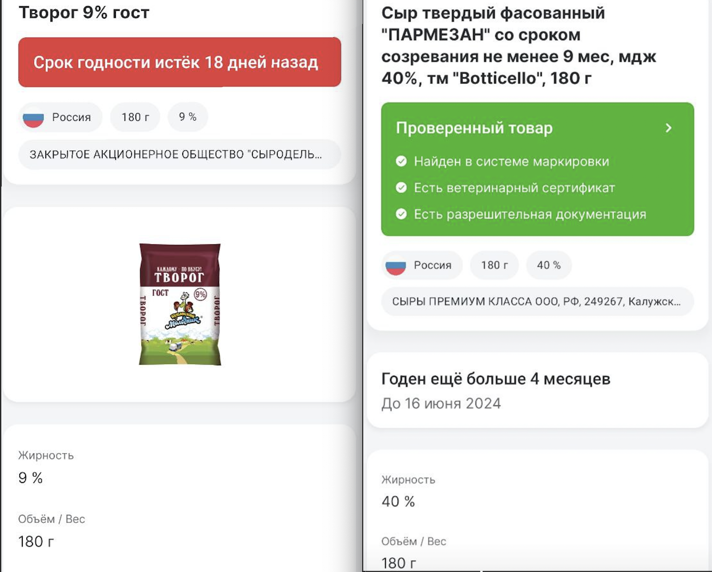
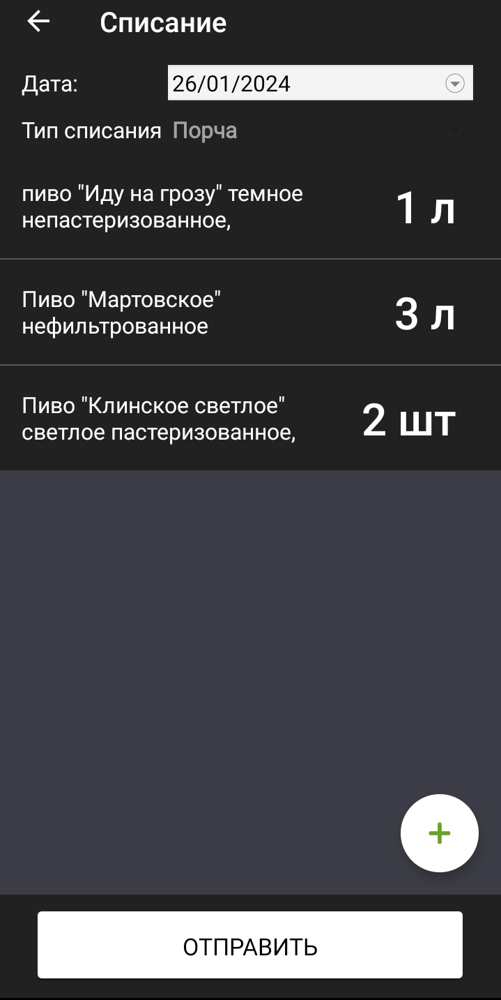

# StockTaking
Учебный проект курса - Kotlin Backend Developer. Professional

StockTaking - приложение для проверки сроков годности маркированной продукции и формирования списка товаров на вывод из оборота.

На вход подаются данные марки Data Matrix (код идентификации/код маркировки). Приложение делает запрос в ГИС МТ, получает сведения из реестров ГИС МТ и возвращает информацию о товаре. Затем сравнивает срок годности товара с текущей датой,
если срок годности истек, сведения о позиции записываются в БД для формирования списка товаров на вывод из оборота.

## Визуальная схема фронтенда

## Документация

1. Маркетинг
    1. [Заинтересанты](./docs/marketing/01-stakeholders.md)
    2. [Целевая аудитория](./docs/marketing/02-target-audience.md)
    3. [Конкурентный анализ](./docs/marketing/03-concurrency.md)
    4. [Анализ экономики](./docs/marketing/04-economy.md)
    5. [Пользовательские истории](./docs/marketing/05-user-stories.md)
2. DevOps
    1. [Схема инфраструктуры](./docs/dev_ops/01-infrastruture.md)
    2. [Схема мониторинга](./docs/dev_ops/02-monitoring.md)
3. Архитектура
   1. [Архитектурная диаграмма](./docs/architecture/01-arch.md)
   2. [Схема интеграции](./docs/architecture/02-integration.md)
   3. [API (эндпоинты, описание сущностей)](./docs/architecture/03-api.md)
4. Тесты
   1. [Тесты](./docs/tests/tests.md)

